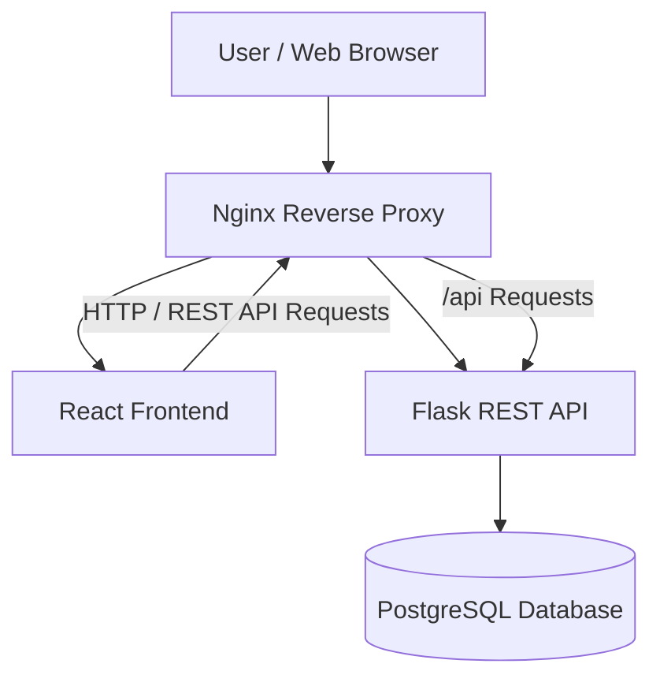

# Personal Expense Management Platform — System Architecture

## 1. Project Overview

The Personal Expense Management Platform is a web application that allows users to manage their personal finances by recording expenses, organizing expenses into categories, setting budgets, and viewing monthly spending summaries.

The application follows a layered architecture consisting of:

* React frontend
* Nginx reverse proxy
* Flask REST API
* PostgreSQL database

The system is designed so that the frontend communicates with the backend API, while the backend handles business logic and database operations.

---

## 2. System Architecture



### Architecture Flow

1. The user accesses the application through a web browser.
2. Nginx acts as the main entry point for the application.
3. Nginx serves the React frontend to the user's browser.
4. The React frontend sends API requests through Nginx.
5. Nginx forwards API requests to the Flask REST API.
6. Flask processes authentication, expenses, categories, budgets, and reporting operations.
7. Flask communicates with PostgreSQL to store and retrieve application data.
8. PostgreSQL is not directly accessible by the user's browser.

---

## 3. Major Components

### Frontend — React

Responsible for the user interface and user interactions.

Main responsibilities:

* User registration and login interface
* Expense management
* Expense categories
* Budget management
* Monthly expense dashboard
* Charts and summaries
* Filtering
* CSV export interface
* Communication with the Flask API

---

### Reverse Proxy — Nginx

Nginx serves as the entry point between users and the application services.

Main responsibilities:

* Serve the React frontend
* Route API requests to Flask
* Provide a single application entry point
* Handle HTTP/HTTPS traffic
* Support production deployment

---

### Backend — Flask

The Flask application provides the REST API and business logic.

Main responsibilities:

* User authentication
* Password handling
* Expense management
* Category management
* Budget management
* Monthly summaries
* Filtering
* CSV export
* Database communication
* API health checks

---

### Database — PostgreSQL

PostgreSQL stores the application's persistent data.

The database will contain information related to:

* Users
* Expenses
* Expense categories
* Budgets
* Monthly expense data

Relationships between these entities will be defined using primary keys and foreign keys.

---

## 4. Component Communication

The main communication paths are:

### User → Nginx

The user's browser connects to the application through Nginx.

### Nginx → React

Nginx serves the React frontend files to the browser.

### React → Flask

The React application communicates with the Flask backend through REST API requests.

### Nginx → Flask

API requests are routed by Nginx to the Flask backend.

### Flask → PostgreSQL

Flask communicates with PostgreSQL to create, retrieve, update, and delete application data.

### PostgreSQL → Flask → React

Database results are returned to Flask, processed by the backend, and then returned to the React frontend through the API.

---

## 5. Repository Structure

The initial repository structure is:

```text
Expense-Management-Platform/
│
├── backend/
│   └── # Flask application
│
├── frontend/
│   └── # React application
│
├── database/
│   └── # Database configuration and migrations
│
├── nginx/
│   └── # Nginx configuration
│
├── docs/
│   └── architecture.md
│
└── README.md
```

Additional files and folders will be added by the relevant team members as development progresses.

---

## 6. Task Dependencies

The project tasks have the following general dependency order:

```text
Architecture
    │
    ├───────────────┐
    ▼               ▼
Database         Security
    │
    ▼
Backend
    │
    ▼
Frontend
    │
    ├──────────────┐
    ▼              ▼
Docker           Nginx
    │              │
    └──────┬───────┘
           ▼
        Azure
           │
           ▼
           QA
```

### Dependency Summary

| Issue | Task               | Depends On                                    |
| ----- | ------------------ | --------------------------------------------- |
| #1    | Architecture       | None                                          |
| #2    | Database           | #1                                            |
| #3    | Backend            | #2                                            |
| #4    | Frontend           | #1, #3                                        |
| #5    | Security           | Project structure and application components  |
| #6    | CI/CD              | Repository structure and application workflow |
| #7    | Docker             | Backend, Frontend                             |
| #8    | Nginx              | Frontend, Backend, Docker                     |
| #9    | Azure Deployment   | Docker, Nginx                                 |
| #10   | QA & Final Testing | Application and deployment                    |

---

## 7. Design Principles

The application architecture follows these principles:

* Separation of frontend, backend, and database responsibilities
* REST-based communication between frontend and backend
* PostgreSQL used as the persistent data store
* Database access restricted to the backend
* Secrets stored through environment variables rather than source code
* Containerized deployment using Docker
* Nginx used as the production reverse proxy
* Infrastructure and deployment configuration kept separate from application code

---

## 8. Security Considerations

Security will be considered throughout development.

The application must:

* Protect user passwords using secure password hashing
* Avoid storing passwords in plain text
* Keep database credentials and API secrets outside source code
* Use environment variables for sensitive configuration
* Prevent secrets from being committed to GitHub
* Restrict direct access to the PostgreSQL database
* Apply appropriate authentication and authorization controls
* Use secure configuration for Docker and Azure deployment

Detailed security implementation will be handled under Issue #5.

---

## 9. Future Deployment Architecture

The application is intended to be containerized and deployed using Docker.

The expected production flow is:

```text
Internet
   │
   ▼
Azure VM
   │
   ▼
Nginx Container
   │
   ├──────────────► React Container
   │
   └──────────────► Flask Container
                         │
                         ▼
                  PostgreSQL Container
```

The final deployment configuration may evolve as the project is implemented.

---

## 10. Architecture Responsibility

The Project Lead / Architect is responsible for:

* Defining the overall architecture
* Coordinating dependencies between teams
* Maintaining architecture documentation
* Ensuring components integrate according to the agreed design
* Reviewing major structural changes
* Coordinating the final integration of the application
