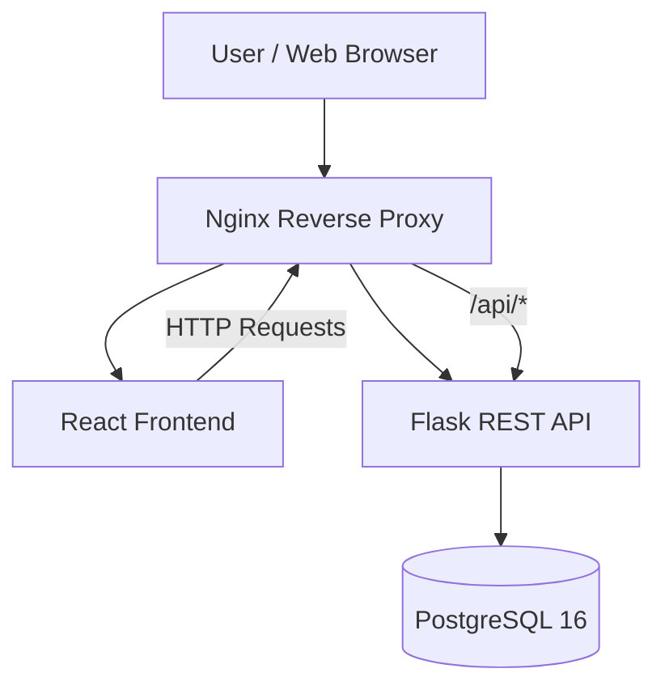

# Personal Expense Management Platform — System Architecture

## 1. Project Overview

The Personal Expense Management Platform is a web application that allows users to manage personal finances by recording expenses, organizing expenses into categories, setting budgets, and viewing spending summaries.

The application uses a layered architecture consisting of:

- React frontend
- Nginx reverse proxy
- Flask REST API
- PostgreSQL 16 database

The application is containerized with Docker Compose for local development and integration testing.

The browser communicates with the application through Nginx. Nginx serves the React frontend and routes `/api` requests to the Flask backend. The Flask backend handles authentication, business logic, validation, and database operations.

PostgreSQL is accessible to the backend through the Docker Compose network and is not directly exposed to the browser.

---

## 2. System Architecture



### Architecture Flow

1. The user accesses the application through a web browser.
2. Nginx provides the main application entry point.
3. Nginx serves the React frontend.
4. The React frontend sends API requests through Nginx.
5. Nginx routes `/api/*` requests to the Flask backend.
6. Flask handles authentication, validation, business logic, and API responses.
7. Flask communicates with PostgreSQL through SQLAlchemy and Psycopg.
8. PostgreSQL stores persistent application data.
9. PostgreSQL is not directly accessible from the user's browser.

---

## 3. Docker Compose Architecture

The current local application stack consists of four services:

```text
                    Browser
                       │
                       ▼
              ┌────────────────┐
              │ Nginx Container│
              │    Port 8080   │
              └───────┬────────┘
                      │
             ┌────────┴────────┐
             ▼                 ▼
    ┌────────────────┐  ┌────────────────┐
    │ React Container│  │ Flask Container│
    │     Port 80    │  │    Port 5000   │
    └────────────────┘  └───────┬────────┘
                                │
                                ▼
                       ┌─────────────────┐
                       │ PostgreSQL 16   │
                       │     Port 5432   │
                       └─────────────────┘
```

### Service Responsibilities

| Service | Container | Internal Port | Purpose |
|---|---|---:|---|
| Nginx | `expense-nginx` | 80 | Application entry point and reverse proxy |
| Frontend | `expense-frontend` | 80 | React application |
| Backend | `expense-backend` | 5000 | Flask REST API |
| PostgreSQL | `expense-postgres` | 5432 | Persistent relational database |

Nginx maps its container port to host port `8080`, so the application is accessed locally through:

```text
http://localhost:8080
```

The frontend and backend are not intended to be accessed directly by the browser during normal application use.

---

## 4. Major Components

### Frontend — React

The React frontend provides the user interface and communicates with the backend API.

Main responsibilities include:

- User registration and login interface
- Expense management
- Expense categories
- Budget management
- Monthly spending summaries
- Charts and dashboard views
- Filtering
- CSV export
- Authentication token handling
- API communication

The frontend communicates with the backend through the Nginx `/api` route.

---

### Reverse Proxy — Nginx

Nginx acts as the application's entry point.

Main responsibilities include:

- Serving the React frontend
- Routing `/api/*` requests to Flask
- Providing a single application endpoint
- Forwarding client request information to the backend
- Supporting health-check routing

The current Nginx configuration routes:

```text
/api/health
    │
    ▼
backend /health

/api/*
    │
    ▼
backend

/*
    │
    ▼
frontend
```

---

### Backend — Flask

The Flask application provides the REST API and application business logic.

Main responsibilities include:

- User registration
- User authentication
- Password hashing
- JWT-based authentication
- Expense CRUD operations
- Category management
- Budget management
- Monthly summaries
- Filtering
- CSV export
- Database communication
- API validation
- Rate limiting
- Application health checks
- Database health checks

The backend listens on port `5000` inside its container.

---

### Database — PostgreSQL 16

PostgreSQL provides persistent storage for application data.

The current database configuration uses:

| Setting | Value |
|---|---|
| Database | `expense_db` |
| User | `expense_user` |
| PostgreSQL Version | 16 |
| Container | `expense-postgres` |
| Internal Port | `5432` |

The database is initialized from:

```text
database/migrations/001_initial_schema.sql
```

The migration is mounted into PostgreSQL's initialization directory and is automatically executed when a new PostgreSQL data volume is initialized.

---

## 5. Component Communication

The main communication paths are:

### User → Nginx

The user's browser connects to the application through Nginx on host port `8080`.

### Nginx → React

Requests that do not match `/api/*` are forwarded to the React frontend container.

### React → Nginx → Flask

The React frontend sends API requests to the same application endpoint through the `/api` path.

Nginx forwards these requests to the Flask backend.

### Flask → PostgreSQL

The Flask backend communicates with PostgreSQL through:

```text
Flask
  │
  ▼
SQLAlchemy
  │
  ▼
Psycopg
  │
  ▼
PostgreSQL 16
```

### PostgreSQL → Flask → Nginx → Browser

Database results are processed by Flask and returned through the API. Nginx forwards the API response to the browser.

---

## 6. Database Architecture

The application uses PostgreSQL as its persistent data store.

The current schema contains:

- `users` — application users
- `expense_categories` — available expense categories
- `expenses` — individual user expenses
- `budgets` — user budget allocations
- `monthly_expense_summary` — monthly expense totals

The database is isolated from the browser and is accessed by the Flask backend over the Docker Compose network.

The PostgreSQL data directory is persisted through the Docker volume:

```text
postgres_data
```

Stopping the containers normally preserves the database data.

Removing the volume with:

```bash
docker compose down -v
```

recreates the database from the initial migration when the stack is started again.

---

## 7. Health Checks

The application includes health checks at multiple layers.

### Backend Application Health

Flask exposes:

```text
GET /health
```

which returns an application health response.

Through Nginx, this is available as:

```text
GET /api/health
```

Example:

```bash
curl http://localhost:8080/api/health
```

---

### Backend Database Health

Flask also exposes:

```text
GET /health/db
```

Through Nginx:

```text
GET /api/health/db
```

Example:

```bash
curl http://localhost:8080/api/health/db
```

The endpoint verifies that the Flask application can successfully execute a database query.

---

### PostgreSQL Health

The PostgreSQL container uses:

```text
pg_isready -U expense_user -d expense_db
```

as its Docker health check.

The backend depends on PostgreSQL becoming healthy before the backend container is started.

---

### Nginx Health

Nginx uses the application health endpoint to verify that the application stack is responding.

The Docker Compose configuration therefore provides health checks across the main service chain.

---

## 8. Repository Structure

The main repository structure is:

```text
Expense-Management-Platform/
│
├── backend/
│   ├── app.py
│   ├── models/
│   ├── routes/
│   ├── utils/
│   ├── requirements.txt
│   └── Dockerfile
│
├── frontend/
│   ├── src/
│   ├── package.json
│   └── Dockerfile
│
├── database/
│   ├── migrations/
│   │   └── 001_initial_schema.sql
│   ├── schema/
│   │   └── schema.sql
│   └── README.md
│
├── nginx/
│   ├── nginx.conf
│   ├── Dockerfile
│   └── README.md
│
├── docs/
│   └── architecture.md
│
├── docker-compose.yml
├── README.md
└── CONTRIBUTING.md
```

The repository may contain additional project documentation and configuration files as development continues.

---

## 9. Security Architecture

Security controls are implemented across the application layers.

### Authentication

The Flask backend uses JWT-based authentication for protected API endpoints.

Authentication tokens are issued during login and supplied by the client when accessing protected resources.

The application does not currently provide a server-side logout endpoint because JWT authentication is stateless. Client-side logout is performed by removing the stored token.

### Password Security

User passwords are not stored as plain text. Passwords are processed using secure password hashing before being stored.

### Database Access

The browser does not connect directly to PostgreSQL.

Database access is restricted to the Flask backend through the Docker Compose network.

### Secrets

Sensitive configuration is supplied through environment variables and local environment files rather than being hard-coded into application source code.

Local `.env` files containing secrets are excluded from version control.

### Rate Limiting

The Flask API includes rate limiting to reduce abuse of application endpoints.

Detailed security controls are documented separately in:

```text
docs/security.md
```

---

## 10. Data and Request Flow

A typical authenticated expense request follows this path:

```text
User
 │
 ▼
Browser
 │
 ▼
Nginx :8080
 │
 │ /api/expenses
 ▼
Flask API :5000
 │
 ▼
Authentication / Validation
 │
 ▼
SQLAlchemy
 │
 ▼
Psycopg
 │
 ▼
PostgreSQL :5432
 │
 ▼
Flask Response
 │
 ▼
Nginx
 │
 ▼
Browser
```

This separation keeps presentation, API/business logic, and persistent storage isolated from one another.

---

## 11. Current Deployment Status

The application is currently implemented and verified as a Docker Compose-based application.

The following local integration has been verified:

- React frontend container
- Nginx reverse proxy
- Flask backend
- PostgreSQL 16
- PostgreSQL initialization from the migration
- Backend-to-database connectivity
- Application health checks
- Database health checks
- Authentication flow
- Expense CRUD operations
- Category operations
- Budget functionality
- Monthly summaries
- Filtering
- CSV export
- Protected API access

All four application containers were successfully verified as healthy during local integration testing.

---

## 12. Planned Azure Deployment

Azure deployment is planned but is **not currently represented as a completed production deployment**.

The intended deployment architecture is:

```text
Internet
   │
   ▼
Azure VM
   │
   ▼
Nginx Container
   │
   ├──────────────► React Container
   │
   └──────────────► Flask Container
                         │
                         ▼
                  PostgreSQL Container
```

The exact Azure infrastructure, networking, secrets management, TLS configuration, monitoring, and production database strategy may evolve when deployment is implemented.

The current architecture should therefore be treated as the implemented Docker Compose architecture, with Azure deployment remaining a planned deployment target.

---

## 13. Design Principles

The architecture follows these principles:

- Separation of frontend, backend, and database responsibilities
- REST-based communication between frontend and backend
- PostgreSQL as the persistent data store
- Database access restricted to the backend
- Environment-based configuration for sensitive values
- Containerized application services
- Nginx as the application reverse proxy
- Health checks for service availability
- Clear separation between application code and deployment configuration
- Reproducible local development through Docker Compose

---

## 14. Architecture Responsibility

The Project Lead / Architect is responsible for:

- Defining and maintaining the overall architecture
- Coordinating dependencies between project components
- Maintaining architecture documentation
- Ensuring services integrate according to the agreed design
- Reviewing major structural changes
- Coordinating application integration
- Keeping architecture documentation aligned with the implemented system
