# CI/CD Pipeline

How code moves from a developer's branch to the Azure deployment. The team's Git workflow is described in [CONTRIBUTING.md](../CONTRIBUTING.md).

## Overview

```mermaid
flowchart LR
    D[Developer] --> B[Working branch]
    B --> PR[Pull Request into main]
    PR --> CI1[CI on PR<br/>tests, build, Docker build]
    CI1 --> R[Review + approval]
    R --> M[Merge to main]
    M --> CI2[CI on main<br/>tests, build, Docker build]
    CI2 -->|only if CI passes| P[CD: publish<br/>Docker images to ghcr.io]
    P --> DEP[Deploy to Azure VM]
    DEP --> H[Health check /health]
```

This matches the order required by the project specification (Phase 10):

| Spec step | Where it happens |
|---|---|
| **Test** | CI: secret scan, database migrations, backend `pytest`, frontend `npm test` |
| **Build** | CI: frontend `npm run build`, backend dependency install and lint |
| **Docker Build** | CI: `docker-build` checks the images build; CD: `publish` builds and pushes them |
| **Deploy** | CD: `deploy` runs `docker compose pull` and `up -d` on the Azure VM |
| **Health Check** | CD: `deploy` calls `<APP_URL>/health` and fails if it does not respond |

CD starts **only after CI has passed on `main`**. If CI fails after a merge, nothing is published or deployed.

| Workflow | File | Runs on |
|---|---|---|
| CI | [`.github/workflows/ci.yml`](../.github/workflows/ci.yml) | Pull requests into `main`, pushes to `main`, manual run |
| CD | [`.github/workflows/cd.yml`](../.github/workflows/cd.yml) | After CI succeeds on `main` (merged PRs), manual run |
| Dependabot | [`.github/dependabot.yml`](../.github/dependabot.yml) | Weekly dependency update PRs |

## CI jobs

Jobs for the backend, frontend and Docker images **turn on automatically** once those parts exist in the repository. Until then they show as *skipped*, which is expected and does not block merging.

| Job | Activates when | What it does |
|---|---|---|
| Detect project components | Always | Checks which components exist and writes a summary |
| Secret scan | Always | Fails if a `.env` file is tracked; scans the full Git history with gitleaks |
| Database migrations | Always | Starts PostgreSQL 16, applies `database/migrations/*.sql` in order, and checks the expected tables exist |
| Backend (lint & test) | `backend/requirements.txt` exists | Python 3.12, installs dependencies, runs `flake8` and `pytest` against a PostgreSQL service |
| Frontend (lint, test & build) | `frontend/package.json` exists | Node 20, `npm ci`, `npm run lint`, `npm test` (if defined), `npm run build` |
| Docker build | `backend/Dockerfile` or `frontend/Dockerfile` exists | Builds each image to check it works (does not push) |
| **ci-success** | Always | Passes only if no other job failed. **This is the one required check.** |

### Expectations for other teams

So their work is picked up by CI automatically:

- **Backend (#3):** put the Flask app in `backend/` with a `requirements.txt` (and optionally `requirements-dev.txt`). Tests go under `backend/tests/` and use `pytest`. Read configuration from `DATABASE_URL`, `SECRET_KEY` and `JWT_SECRET`; CI sets these to test values.
- **Frontend (#4):** put the React app in `frontend/` with a committed `package-lock.json` and a `build` script. Add `lint` and `test` scripts when available. Tests must not run in watch mode when `CI=true`.
- **Docker (#7):** add `backend/Dockerfile` and `frontend/Dockerfile`, each using its own folder as the build context. Put `docker-compose.yml` at the repository root and reference the published images (below).

## CD jobs

| Job | What it does |
|---|---|
| Publish image | Runs only if CI passed. For each service with a Dockerfile, builds the exact commit CI tested and pushes `ghcr.io/ayomideadejare1/expense-management-platform-<service>` tagged `latest` and `sha-<commit>` |
| Deploy to Azure VM | Connects to the VM over SSH, runs `git pull`, `docker compose pull` and `docker compose up -d`, then checks `<APP_URL>/health` |

Images are published to GitHub Container Registry using the built-in `GITHUB_TOKEN`, so no registry secrets are needed.

### Enabling deployment (after Azure issue #9)

Deployment is **off by default**. Once the Azure VM exists and has Docker, a clone of this repository and a production `.env`:

1. In **Settings → Environments**, create an environment named `production`. Optionally add required reviewers so each deploy needs approval.
2. In **Settings → Secrets and variables → Actions**, add:

   | Type | Name | Value |
   |---|---|---|
   | Secret | `AZURE_VM_HOST` | VM public IP or DNS name |
   | Secret | `AZURE_VM_USER` | SSH user on the VM |
   | Secret | `AZURE_VM_SSH_KEY` | Private SSH key for that user (create a key used only for deployment) |
   | Variable | `APP_URL` | Public base URL, for example `https://expense.example.com` |
   | Variable | `DEPLOY_PATH` | Repository folder on the VM (default `~/expense-management-platform`) |
   | Variable | `DEPLOY_ENABLED` | `true` |

3. If the images are private, run `docker login ghcr.io` once on the VM using a personal access token with the `read:packages` scope, or make the packages public.

Production secrets such as `POSTGRES_PASSWORD` and `SECRET_KEY` stay in the `.env` file on the VM. They are never stored in the repository.

## Branch protection (repository owner)

Only a repository admin can set this. In **Settings → Branches → Add branch ruleset** (or the classic rule) for `main`:

- [x] Require a pull request before merging
  - [x] Required approvals: **1**
  - [x] Dismiss stale approvals when new commits are pushed
- [x] Require status checks to pass before merging
  - [x] Require branches to be up to date before merging
  - Required check: **`ci-success`** (it appears in the list after CI has run once)
- [x] Require conversation resolution before merging
- [x] Block force pushes
- [x] Restrict deletions

## Branch clean-up (repository owner)

The `develop` branch and some area branches still point at the initial commit and are behind `main`. Teams should merge `origin/main` into their area branch before starting work. `develop` is not part of this workflow and can be deleted.

## Troubleshooting

| Symptom | Fix |
|---|---|
| `ci-success` is red | Open the run and find the failed job above it; `ci-success` only reports their results |
| Secret scan fails | Remove the secret, rotate it, and tell the team. Deleting it in a new commit does not remove it from Git history |
| Database job fails | A migration has a SQL error. Run it locally with `psql -v ON_ERROR_STOP=1 -f <file>` |
| `npm ci` fails | Commit `frontend/package-lock.json` and keep it in sync with `package.json` |
| CD did not run or was skipped | CI failed on `main` (fix CI first), `DEPLOY_ENABLED` is not `true`, or the run was not on `main` |
| Health check fails after deploy | SSH to the VM and run `docker compose ps` and `docker compose logs` |
